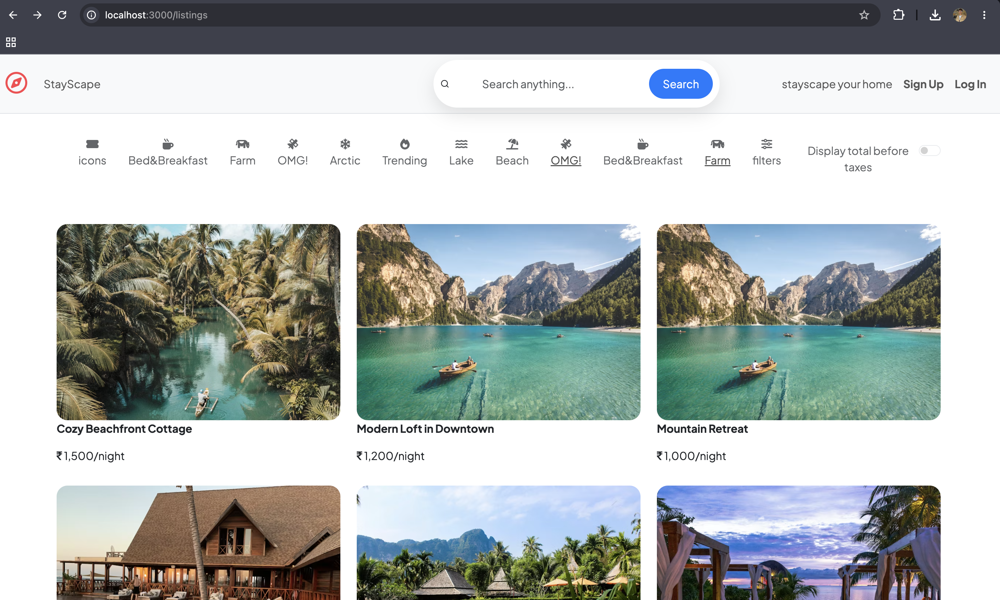
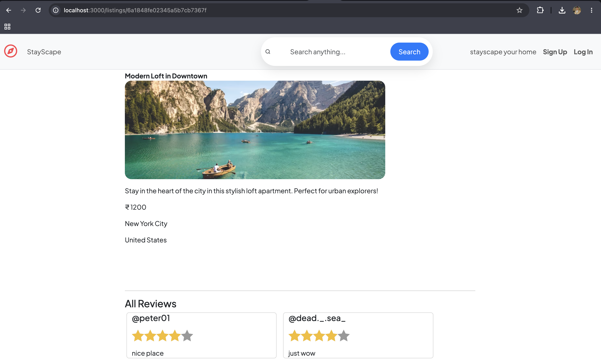
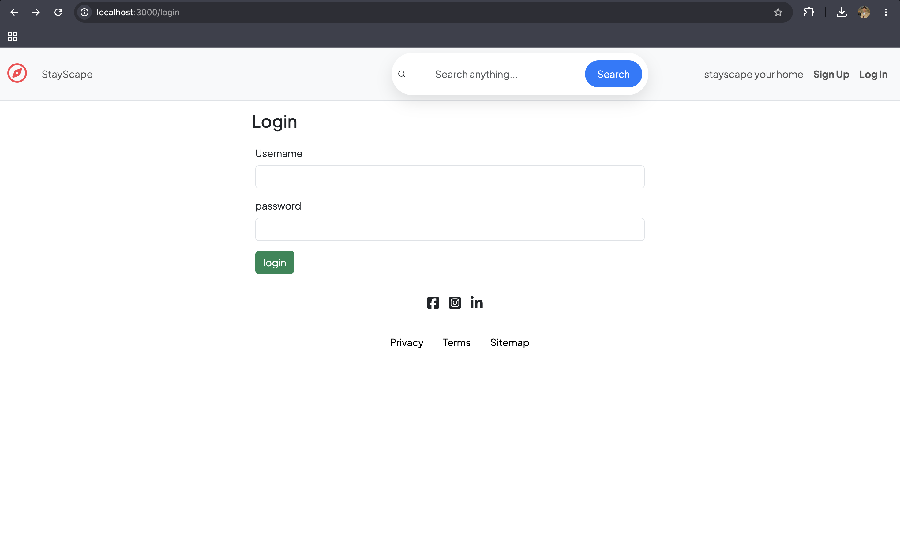
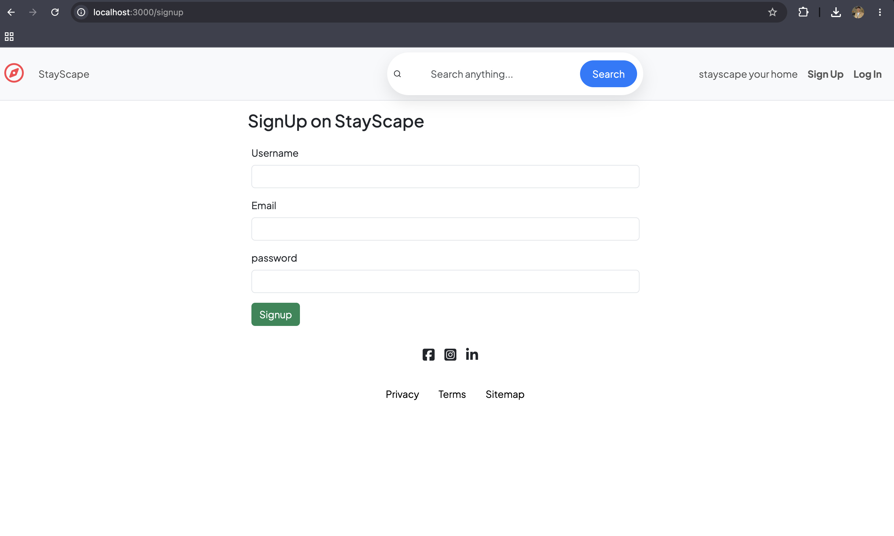

# 🏡 StayScape — Your Vacation Stay Companion

A full-stack vacation rental web application inspired by Airbnb. StayScape allows users to explore, list, and manage vacation homes seamlessly. Built with Node.js, Express, MongoDB, and EJS templates.

## 🌟 What is StayScape?

StayScape is a combination of two words:

**Stay** – To reside, rest, and feel at home wherever you are.

**Scape** – A view, a landscape, a scene worth experiencing.

Together, StayScape represents the idea of finding your perfect stay with a view — whether it's a beachfront cottage, a mountain cabin, or a luxury villa. It's not just a place to sleep, it's ascape to remember.

---

## ✨ Features

- 🔍 Browse and search vacation listings
- 🏠 Create, edit, and delete listings with image uploads
- ⭐ Leave reviews and star ratings on listings
- 🔐 User authentication  (Local + Google OAuth)
- 🖼️ Cloudinary integration for image uploads
- 🗺️ Location-based listing display
- 📱 Fully responsive design with Bootstrap
- ⚡ Flash messages for user feedback
- 🛡️ Authorization — only owners can edit/delete their listings

---
## 📸 Screenshots
 
### 🏠 Home Page

 
### 📄 Listing Detail Page

 
### 🔐 Login Page

 
### 📝 Sign Up Page


## 🔧 Tech Stack

| Layer | Technology |
|---|---|
| Backend | Node.js, Express.js |
| Database | MongoDB, Mongoose |
| Frontend | EJS Templates, Bootstrap 5 |
| Authentication | Passport.js (Local + Google OAuth 2.0) |
| File Storage | Cloudinary|
| Validation | Joi |
| Session | Express-Session |

---

# 🚀 Project Goal

StayScape aims to simulate a real-world vacation rental platform, helping developers understand full-stack architecture, secure payment integration, and user-friendly booking flows.

---

## 📁 Project Structure

```
StayScape/
├── controller/        # Route logic
│   ├── listing.js
│   ├── reviews.js
│   └── user.js
├── models/            # Mongoose schemas
│   ├── listing.js
│   ├── review.js
│   └── user.js
├── routes/            # Express routers
│   ├── listing.js
│   ├── review.js
│   └── user.js
├── views/             # EJS templates
│   ├── listings/
│   ├── user/
│   └── layouts/
├── public/            # Static assets
│   ├── css/
│   └── js/
├── init/              # Seed data
│   ├── data.js
│   └── index.js
├── utils/             # Helper functions
├── middleware.js      # Custom middleware
├── cloudConfig.js     # Cloudinary config
├── schema.js          # Joi validation schemas
└── app.js             # Entry point
```

---


## 👤 Author

**Aditya Maurya**
- GitHub: [@adityaom589](https://github.com/adityaom589)

## 🌐 Live Demo
👉 [stayscape-aysc.onrender.com](https://stayscape-aysc.onrender.com)

---

